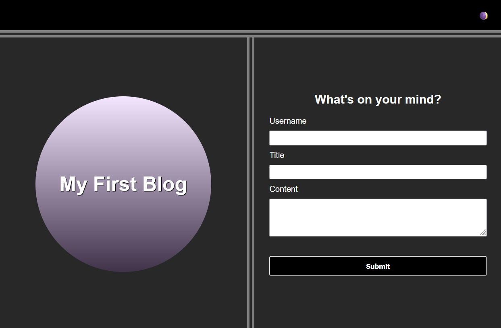

# Personal Blog

## Description

A personal blog made with HTML, CSS, and JavaScript. The blog features a theme toggle, basic form validation, and use of browser local storage.

## Screenshots

Below are screenshots of the blog pages in both light theme and dark theme.

## Deployment

This blog is deployed to GitHub pages at:

[https://kim-lan.github.io/bootcamp-module-04-personal-blog/](https://kim-lan.github.io/bootcamp-module-04-personal-blog/)
